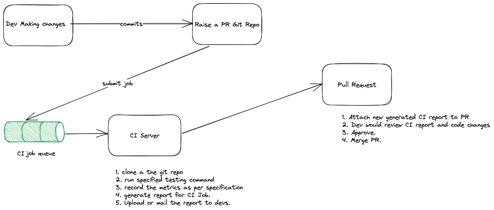

# System Design for Local Continuous Integration.

## Requirements:

1. CI system which runs automated tests when a new commit is pushed.
2. Generates Report and dumps it to mail or slack

## Implementation:

1. Everytime a git commit is pushed, the specified testing command in yaml file would be executed.
2. Use Github API to trigger CI job.
3. Job would be simple JSON file with commands to run, git repo to clone, report location to dump.
4. Each Job would be dockerized and ran in container, so dependencies wouldn't create problem.

## Components:

### CI Job Queue:

1. A simple Python Process which runs independently in background, saves CI job queue locally.
2. CI Job queue only job is to hold the jobs in queue and nothing else, other processes would store, retrieve, remove jobs from this.

### Server

1. Which checks for new task in queue, create docker container for git repo, runs the container, cleansup a task and updates the job status.

